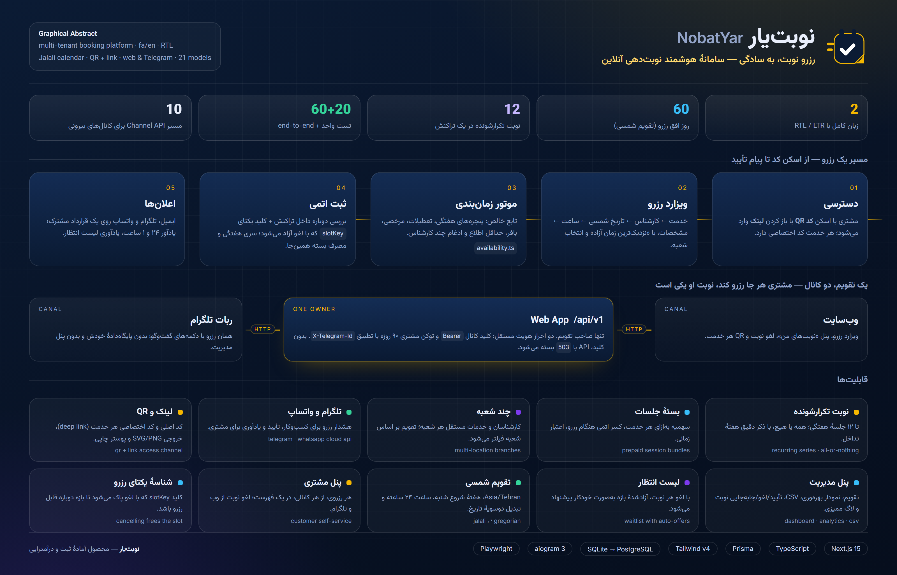

# NobatYar — نوبت‌یار

> **سامانه هوشمند رزرو نوبت آنلاین**
> A production-grade appointment platform for clinics, salons, consultants and any
> service business — **bookable by link, by QR code, or inside Telegram.**



Customers book in under a minute. Staff run the whole business from one
dashboard. The calendar is bilingual (Persian RTL / English LTR), uses the Jalali
calendar, and has exactly one owner — so a time booked anywhere is immediately
unavailable everywhere.

**Tagline — رزرو نوبت، به سادگی.** *Booking an appointment, made simple.*

📖 **New to this project?** Read the **[Complete Guide](GUIDE.md)** — how it works, every
screen, every panel, and how to run it from zero.

---

## What's in the box

This repository holds two programs that do different jobs.

```
poroje nobatdehi/
├── nobatyar/         the product — website, database, dashboard, channel API
├── appointment_bot/  a Telegram interface over that same API
└── GUIDE.md          the full guide
```

| | [`nobatyar/`](nobatyar) | [`appointment_bot/`](appointment_bot) |
|---|---|---|
| What it is | The website, the database, the staff dashboard, and an API | A Telegram *front-end* for that API |
| Stack | Next.js 15 · TypeScript · Tailwind · Prisma | Python 3 · aiogram |
| Owns the data? | **Yes** — one database, one booking engine | **No** — it has no database at all |
| Who uses it | Customers (public site) · staff (dashboard) | Customers, inside Telegram |
| Management UI | Everything | Nothing, by design |

### The one decision that explains the design

**The web app owns the calendar; the bot is a remote control for it.**

Two systems that each keep their own appointment list will eventually disagree,
and that disagreement is a double booking the first time a customer uses both.
So the bot keeps no data: it asks the web app what is free, and posts the
customer's choice back. Management lives in the dashboard, on the web, where it
belongs.

```
   customer on Telegram            customer on the web
            │                                │
            ▼                                ▼
   appointment_bot  ──── HTTP ────►   nobatyar /api/v1/*  ──►  database
                                          │
                                          ▼
                                 booking engine (src/lib/booking.ts)
                                          │
                    ┌─────────────────────┼─────────────────────┐
                    ▼                     ▼                     ▼
             dashboard  ◄──────  notifications  ──────►  Telegram / WhatsApp / email
```

---

## Quick start

Two terminals. **The website first** — the bot refuses to start without it.

### 1. The website

```bash
cd nobatyar
npm install
cp .env.example .env        # set AUTH_SECRET and CHANNEL_API_SECRET
npm run db:push             # create the schema
npm run db:seed             # demo business: 6 services, 4 specialists, 92 appointments
npm run dev                 # http://localhost:3000 → /fa
```

> On Windows use `npm.cmd` — PowerShell blocks `npm.ps1` by default. If
> `npm install` won't run a postinstall script, npm 11+ needs
> `npm install --allow-scripts` (that's Prisma downloading its engine).

Generate a secret with:

```bash
node -e "console.log(require('crypto').randomBytes(48).toString('base64url'))"
```

### 2. The Telegram bot

```bash
cd appointment_bot
python -m venv ../venv && source ../venv/bin/activate   # Windows: ..\venv\Scripts\Activate.ps1
pip install -r requirements.txt
cp .env.example .env        # BOT_TOKEN from @BotFather, + the same CHANNEL_API_SECRET
python main.py
```

### 3. Sign in

| Account | Password | Sees |
|---|---|---|
| `owner@nobatyar.app` | `Nobat#2026` | Everything, as the business owner |
| `manager@nobatyar.app` | `Nobat#2026` | Everything except deletions and settings |
| `customer@nobatyar.app` | `Nobat#2026` | A customer with booking history and a package |

> The login page only *shows* these credentials outside production. Before
> deploying, **delete the seeded accounts** — a build-time check cannot do that
> for you.

---

## Features

| Area | What ships |
|------|-----------|
| **Booking** | A three-step wizard — service → specialist → time → confirm — with guest booking and "earliest available" across the whole team. |
| **Availability** | Pure, unit-tested engine: weekly windows, breaks, holidays, time off, per-service buffers, min-notice and horizon. Slots are *computed*, never stored. |
| **No double bookings** | A nullable unique `slotKey` (`staffId:epochMs`) is set on booking and **cleared on cancellation**, so a freed time can genuinely be rebooked. See below. |
| **Recurring** | 1–12 weekly sessions in one transaction, all-or-nothing. A refusal names the exact week that failed. |
| **Packages** | Prepaid session bundles with a per-service quota, decremented atomically inside the booking transaction. |
| **Multi-branch** | Branches with their own hours, staff and services; availability is branch-scoped. |
| **Waitlist** | Customers queue for a full slot; the first match is offered the moment it frees. |
| **Customer panel** | The website (`/my-appointments`) and Telegram both list a customer's bookings, whatever channel they came from, and both can cancel. |
| **Link + QR** | A booking URL and a scannable QR per service, printable as a poster, plus a public `/api/qr` renderer. |
| **Dashboard** | 11 sections: overview KPIs and charts, calendar, appointments, services, staff, waitlist, link/QR, packages, branches, notifications, settings. |
| **Notifications** | Telegram, WhatsApp and email behind one contract, switched on purely by environment variables. Every delivery is logged and viewable. |
| **i18n** | Full Persian (RTL) and English (LTR) catalogues, Jalali ⇄ Gregorian conversion, `/fa` and `/en` routing, `hreflang` alternates. |
| **Channel API** | `/api/v1` — 10 endpoints, two credentials, fails closed. Today the Telegram bot uses it; tomorrow a call centre could. |

### The detail worth knowing: cancelled appointments free their slot

The obvious way to stop double bookings is a unique index on
`(staffId, startsAt)`. It works right up until someone cancels — the row still
occupies the index, so **that time can never be booked again**, and the calendar
quietly rots. That bug happened here.

Reservation is now a nullable unique `slotKey`, set when booked and `NULL` once
cancelled. There is a regression test that books, cancels, and rebooks the very
same instant.

---

## Commands

<details>
<summary><b>Website — <code>nobatyar/</code></b></summary>

| Command | What it does |
|---|---|
| `npm run dev` | Development server on :3000 |
| `npm run build` / `npm start` | Production build / serve |
| `npm run typecheck` | `tsc --noEmit` |
| `npm test` | 60 unit tests (Vitest) |
| `npm run test:e2e` | 20 browser tests (Playwright, port 3210) |
| `npm run test:all` | typecheck → unit → build → e2e, the full gate |
| `npm run channel:smoke` | 34 checks against a running server |
| `npm run verify` | Page and API smoke test |
| `npm run db:push` / `db:seed` / `db:reset` / `db:studio` | Schema and data |
| `npm run abstract` | Re-render the graphical abstract |

</details>

<details>
<summary><b>Bot — <code>appointment_bot/</code></b></summary>

```bash
python -m pytest        # 18 unit + 3 live tests
python main.py          # run the bot
```

</details>

---

## Documentation

| Document | Read it for |
|----------|-------------|
| **[GUIDE.md](GUIDE.md)** | Everything, from zero: architecture, every page, both customer panels, all 11 dashboard sections, roles, the booking engine, the channel API, the schema, troubleshooting, and what is *not* built yet |
| **[nobatyar/README.md](nobatyar/README.md)** | The web app in depth: availability engine, data model, security checklist, deployment |
| **[appointment_bot/README.md](appointment_bot/README.md)** | The bot: setup, the channel contract, the IPv4 pin |

---

## Status

Green: `npm run test:all` exits 0 — 60 unit tests, a clean production build, and
20 end-to-end browser tests. The channel API smoke suite passes 34/34.

Known and unbuilt: rooms and equipment per branch, per-service intake forms, SMS
transports, a hosted API reference and webhooks, online payments, and load
testing. `GUIDE.md` §17 lists these with reasons.

---

## Stack

Next.js 15 (App Router, RSC, Server Actions) · TypeScript strict · Tailwind CSS v4 ·
Prisma 6 + SQLite (Postgres-ready) · Zod · `jose` + `bcryptjs` · Recharts ·
`qrcode` · Vitest · Playwright · aiogram 3 (Python)

---

© NobatYar — رزرو نوبت، به سادگی.
